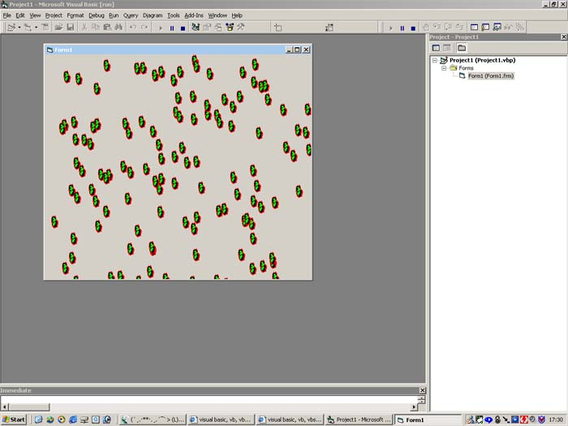



## \[\[\[ Let your app automatically add controls \(eg\. pictureboxes etc\.\) \]\]\]

### Description

This code ADDS controls. This program is an example with bacterial pictures. It Adds as many bacterial pictures as possible! Just check it out what I mean. And if you like it please vote for me or give comments
 
### More Info
 

             |
---                |---
**Submitted On**   |2002-05-04 17:34:24
**By**             |[Melvin T\.](https://github.com/Planet-Source-Code/PSCIndex/blob/master/ByAuthor/melvin-t.md)
**Level**          |Intermediate
**User Rating**    |4.5 (45 globes from 10 users)
**Compatibility**  |VB 5\.0, VB 6\.0
**Category**       |[Coding Standards](https://github.com/Planet-Source-Code/PSCIndex/blob/master/ByCategory/coding-standards__1-43.md)
**World**          |[Visual Basic](https://github.com/Planet-Source-Code/PSCIndex/blob/master/ByWorld/visual-basic.md)
**Archive File**   |[\[\[\[\_Let\_yo113960832002\.zip](https://github.com/Planet-Source-Code/melvin-t-let-your-app-automatically-add-controls-eg-pictureboxes-etc__1-37582/archive/master.zip)

